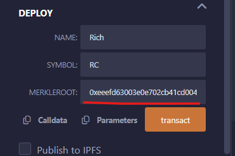

## Using Merkle Tree to issue NFT whitelist

For a whitelist with 800 addresses, the gas fee required to update it can easily exceed 1 ETH. 
When verifying Merkle Tree, leaf and proof can be stored in the backend, and only one root value needs to be stored on the chain, which saves a lot of gas. 
Project parties often use it to issue whitelists (Many whitelists/airdrops of ERC721 standard NFTs and ERC20 standard tokens are issued using Merkle Tree, such as Optimism's airdrop).

We deploy contract "MerkleTree"(Inherited from "ERC721") 

MerKle Root is: 0xeeefd63003e0e702cb41cd0043015a6e26ddb38073cc6ffeb0ba3e808ba8c097, this could be found in link [Merkle Tree Js](https://lab.miguelmota.com/merkletreejs/example/) . 

Then, run the "mint" function to mint NFT to address 0. The three parameters are:
account = 0x5B38Da6a701c568545dCfcB03FcB875f56beddC4 
tokenId = 0 
proof = [   "0x999bf57501565dbd2fdcea36efa2b9aef8340a8901e3459f4a4c926275d36cdb",   "0x4726e4102af77216b09ccd94f40daa10531c87c4d60bba7f3b3faf5ff9f19b3c" ] 

Mint:

We can use the "ownerOf" function to verify that the NFT with tokenId 0 has been minted to address 0x5B38Da6a701c568545dCfcB03FcB875f56beddC4, and the contract has run successfully!

At this point, if the mint function is called again, although the address can pass the Merkle Proof verification, since the address has been recorded in mintedAddress, the transaction will be terminated due to "Already minted!"

